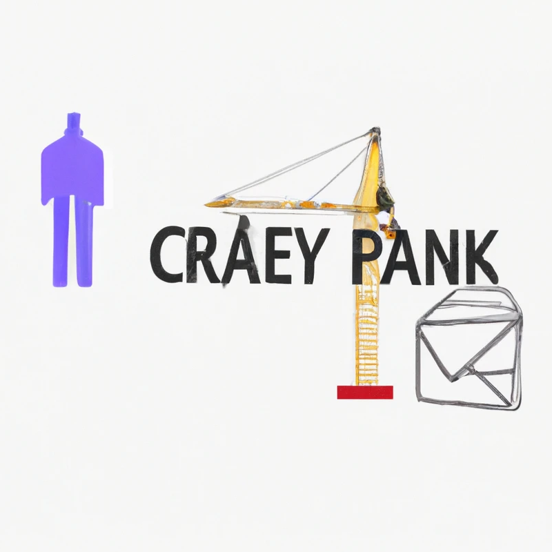

# Weekly CRAN Packages

 

## Descripción

Weekly CRAN Packages es un proyecto que se enfoca en mantener a la comunidad de R informada sobre los cambios, adiciones y eliminaciones de paquetes en el ecosistema de R. 

Semanalmente, este proyecto descarga la lista completa de paquetes disponibles en CRAN (Comprehensive R Archive Network)  y  genera un boletín que resume los eventos más importantes relacionados con los paquetes de R durante la semana.

## Objetivos

El objetivo principal de Weekly CRAN Packages es proporcionar una fuente confiable y actualizada de información para todos los usuarios, desarrolladores y entusiastas de R. Nuestro objetivo es ayudar a la comunidad a estar al tanto de los cambios en el ecosistema de paquetes, lo que permitirá aprovechar al máximo las capacidades y mejoras que ofrecen estos recursos. Algunos de nuestros objetivos específicos incluyen:

1. **Informar sobre cambios relevantes:** Nuestro boletín semanal destaca los paquetes que han sido actualizados con nuevas versiones y resume los cambios realizados en cada actualización. También destacamos aquellos paquetes que han sido eliminados o descontinuados.

2. **Promover paquetes nuevos:** Reconocemos la importancia de la comunidad en la creación de nuevos paquetes de R. Por ello, nuestro boletín incluye una sección dedicada a presentar y resaltar los paquetes recientemente agregados a los repositorios.

3. **Fomentar la colaboración y retroalimentación:** Al proporcionar esta información, esperamos estimular la colaboración entre usuarios y desarrolladores de paquetes de R, así como fomentar la retroalimentación constructiva para mejorar la calidad y utilidad de los paquetes.

## Cómo funciona

El proyecto Weekly CRAN Packages está impulsado por un conjunto de scripts y herramientas desarrolladas en lenguaje R y Python. Estas herramientas permiten realizar las siguientes tareas:

1. **Descarga y actualización de paquetes:** Semanalmente, nuestro sistema descarga la lista completa de paquetes disponibles en CRAN y otros repositorios relevantes.

2. **Análisis de cambios:** Después de obtener la lista de paquetes, nuestro sistema compara las versiones actuales con las versiones anteriores para identificar cambios relevantes, nuevas incorporaciones y paquetes eliminados.

3. **Generación del boletín:** Una vez que el análisis de cambios se ha completado, generamos automáticamente un boletín que resume los eventos más importantes en el ecosistema de paquetes de R.

4. **Distribución y difusión:** El boletín se publica en nuestro sitio web y se envía a través de correos electrónicos a los suscriptores. Además, compartimos enlaces a través de nuestras redes sociales para alcanzar a la comunidad más amplia de usuarios de R.

## Contribuciones

¡Agradecemos y valoramos tus contribuciones! Si deseas participar en el proyecto Weekly CRAN Packages, puedes contribuir de diversas formas:

1. **Reportar problemas:** Si encuentras algún problema con el boletín o tienes alguna sugerencia de mejora, por favor, abre un "Issue" en nuestro repositorio de GitHub.

2. **Agregar características:** Si tienes ideas para mejorar el proyecto o implementar nuevas características, no dudes en abrir un "Pull Request" con tus cambios.

3. **Difundir el proyecto:** Comparte el boletín semanal y nuestro repositorio con otros miembros de la comunidad de R para que más personas puedan beneficiarse de la información proporcionada.

## Licencia

Weekly CRAN Packages se distribuye bajo la Licencia MIT. Puedes encontrar más detalles en el archivo [LICENSE](LICENSE) de nuestro repositorio en GitHub.

## Contacto

Si tienes preguntas, comentarios o sugerencias, puedes ponerte en contacto con nosotros a través de nuestro correo electrónico: [vj.velascorios@protonmail.com](mailto:vj.velascorios@protonmail.com).
